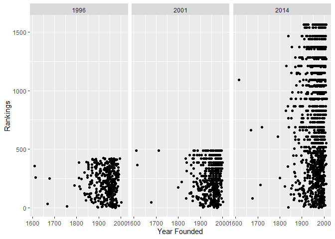
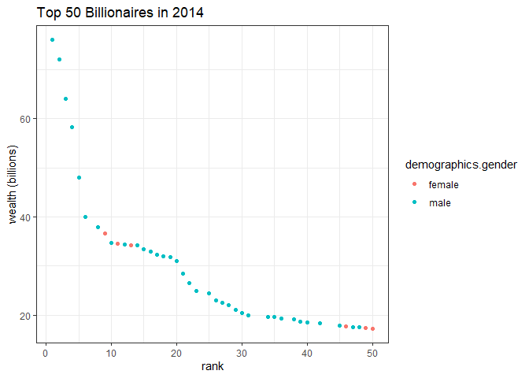
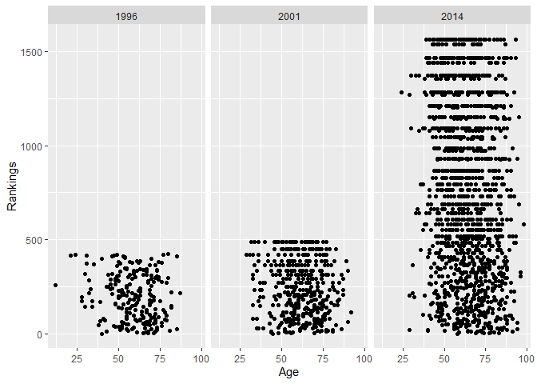
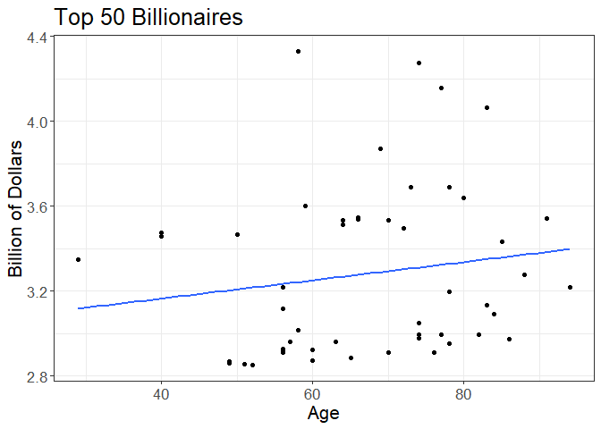
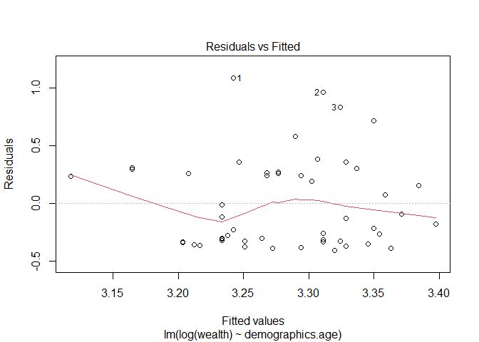
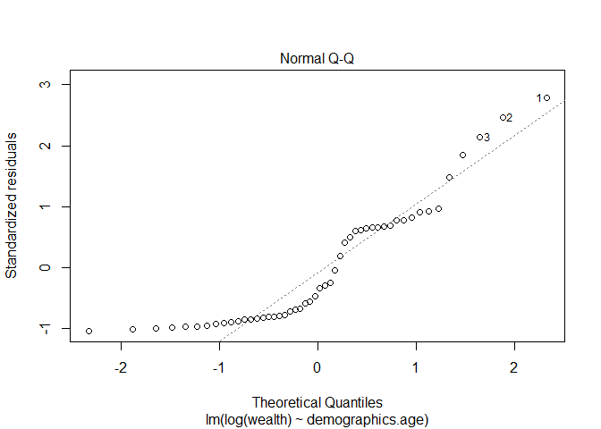
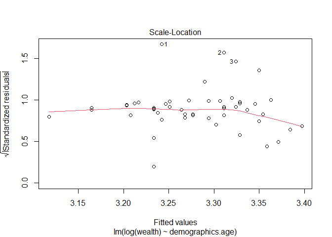
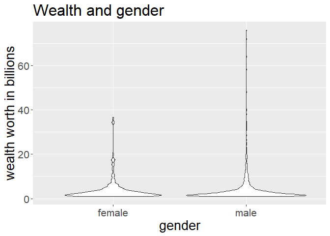
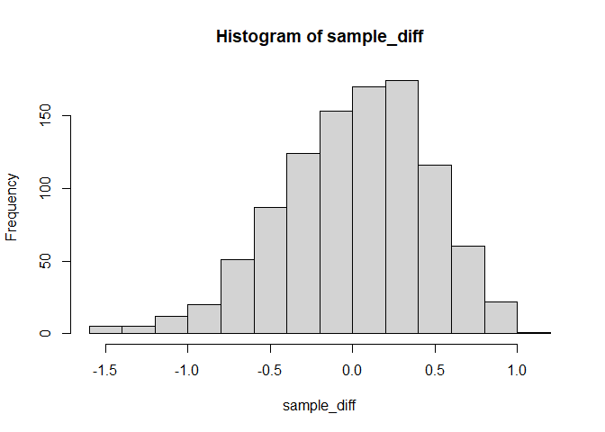

# Introduction

Our goal is to figure out what factors contribute to the rank in which
certain billionaires fall. The rank is comparing the income between
billionaires and we are interested in whether age, gender, company type,
location, inherited through family, or the year the company was founded,
played a large factor in their rank. We are interested in the lifestyle
choices that billionaires make in order to become as successful as they
are today. The topic was something that interested all of us for our
future lives and billionaires have always been a topic of interest
because of how differently they live their lives.

# Data

``` r
library(tidyverse)

billionaires <- read_csv(here::here("data/billionaires.csv"))
glimpse(billionaires)
```

    ## Rows: 2,614
    ## Columns: 22
    ## $ name                       <chr> "Bill Gates", "Bill Gates", "Bill Gates", "~
    ## $ rank                       <dbl> 1, 1, 1, 2, 2, 2, 3, 3, 3, 4, 4, 4, 5, 5, 5~
    ## $ year                       <dbl> 1996, 2001, 2014, 1996, 2001, 2014, 1996, 2~
    ## $ company.founded            <dbl> 1975, 1975, 1975, 1962, 1962, 1990, 1896, 1~
    ## $ company.name               <chr> "Microsoft", "Microsoft", "Microsoft", "Ber~
    ## $ company.relationship       <chr> "founder", "founder", "founder", "founder",~
    ## $ company.sector             <chr> "Software", "Software", "Software", "Financ~
    ## $ company.type               <chr> "new", "new", "new", "new", "new", "privati~
    ## $ demographics.age           <dbl> 40, 45, 58, 65, 70, 74, 0, 48, 77, 68, 56, ~
    ## $ demographics.gender        <chr> "male", "male", "male", "male", "male", "ma~
    ## $ location.citizenship       <chr> "United States", "United States", "United S~
    ## $ `location.country code`    <chr> "USA", "USA", "USA", "USA", "USA", "MEX", "~
    ## $ location.gdp               <dbl> 8.10e+12, 1.06e+13, 0.00e+00, 8.10e+12, 1.0~
    ## $ location.region            <chr> "North America", "North America", "North Am~
    ## $ wealth.type                <chr> "founder non-finance", "founder non-finance~
    ## $ `wealth.worth in billions` <dbl> 18.5, 58.7, 76.0, 15.0, 32.3, 72.0, 13.1, 3~
    ## $ wealth.how.category        <chr> "New Sectors", "New Sectors", "New Sectors"~
    ## $ `wealth.how.from emerging` <lgl> TRUE, TRUE, TRUE, TRUE, TRUE, TRUE, TRUE, T~
    ## $ wealth.how.industry        <chr> "Technology-Computer", "Technology-Computer~
    ## $ wealth.how.inherited       <chr> "not inherited", "not inherited", "not inhe~
    ## $ `wealth.how.was founder`   <lgl> TRUE, TRUE, TRUE, TRUE, TRUE, TRUE, TRUE, T~
    ## $ `wealth.how.was political` <lgl> TRUE, TRUE, TRUE, TRUE, TRUE, TRUE, TRUE, T~

## Data Analysis Plan

Our primary variable of interest is the rank of billionaires. We will be
using demographics.age, demographics.gender, company.sector,
location.citizenship, company.founded, and wealth.type.  
 

### It takes some time for a person to become wealthy. For those billionaires, was it always the case that the longer their company founded the wealthier they were? In another words, is the year of foundation related to the ranking positively?

``` r
billionaires %>% 
  filter(company.founded != 0) %>% 
  ggplot(aes(x = company.founded,
             y = rank)) +
  geom_point() +
  facet_grid(.~year) +
  labs(x = "Year Founded",
       y = "Rankings") +
  theme(text = element_text(size = 15)) +
  theme_update()
```

<!-- -->

Based on the graph of wealth rankings and year of foundation under
different years, the majority of billionaires founded their companies in
1900-2000. There were many top wealth rankings came from the majority
group. Therefore, it is not the case that the rank and foundation years
are positively related. People can set up a company relatively late and
still become top-ranking billionaires.  
 

### The type of wealth is also very related to the rankings. People might have wealth inherited from their families or they made their own fortune. What type of wealth have the highest median rankings among other types?

``` r
highest_median_type <- billionaires %>% 
  filter(wealth.type != "", year == 2014) %>% 
  select(rank, wealth.type) %>% 
  mutate(wealth.type = as.factor(wealth.type)) %>% 
  group_by(wealth.type) %>% 
  summarize(Rank_Median = median(rank),
            Rank_Mean = mean(rank)) %>% 
  filter(Rank_Median == min(Rank_Median)) %>% 
  select(wealth.type) %>% 
  pull()
```

The type of wealth which were inherited has the highest ranking median,
so those people might have decent positions on the wealth board.  
 

### It is reasonable that the environment of regions will affect people’s lives. Better regions may have more rich people. It is possible that the citizenship will be related to the rank.

``` r
counts <- billionaires %>% 
  filter(year == 2014) %>% 
  count(location.citizenship, sort=TRUE)
counts
```

    ## # A tibble: 69 x 2
    ##    location.citizenship     n
    ##    <chr>                <int>
    ##  1 United States          499
    ##  2 China                  152
    ##  3 Russia                 111
    ##  4 Germany                 85
    ##  5 Brazil                  65
    ##  6 India                   56
    ##  7 United Kingdom          47
    ##  8 Hong Kong               45
    ##  9 France                  43
    ## 10 Italy                   35
    ## # ... with 59 more rows

``` r
mean_median_region <- billionaires %>% 
  filter(year == 2014) %>% 
  select(location.citizenship, rank) %>%
  group_by(location.citizenship) %>% 
  summarize(mean_rank = mean(rank, na.rm = TRUE),
            median_rank = median(rank, na.rm = TRUE))

max_mean_region <- mean_median_region %>% 
  filter(mean_rank == max(mean_rank)) %>% 
  select(location.citizenship) %>% 
  pull()

max_med_region <- mean_median_region %>% 
  filter(mean_rank == max(median_rank)) %>% 
  select(location.citizenship) %>% 
  pull()
```

According the table above, citizenship have effect on the number of
billionaires. Strong countries such as USA, Germany and China have more
billionaires, but we should also consider the different amounts of
populations in different regions. Moreover, Lithuania, Tanzania has the
largest average rank and Lithuania, Tanzania has the largest median
rank. However, these regions with the largest mean and the largest
median have only few billionaires.  
 

### We also wanted to test whether gender played a role in the ranking of billionaires and also tested to what percentage of billionaires are women compared to men.

``` r
## selecting top 50 billionaires for 2014
billionaires <- read_csv(here::here("data/billionaires.csv"))
```

    ## Rows: 2614 Columns: 22

    ## -- Column specification --------------------------------------------------------
    ## Delimiter: ","
    ## chr (13): name, company.name, company.relationship, company.sector, company....
    ## dbl  (6): rank, year, company.founded, demographics.age, location.gdp, wealt...
    ## lgl  (3): wealth.how.from emerging, wealth.how.was founder, wealth.how.was p...

    ## 
    ## i Use `spec()` to retrieve the full column specification for this data.
    ## i Specify the column types or set `show_col_types = FALSE` to quiet this message.

``` r
billionaire_2014 <- billionaires %>%
  filter(year == 2014 & rank <= 50) %>%
  rename(money_rank = "wealth.worth in billions") 


# graph top 50 billionaires to see gender comparison
ggplot(data = billionaire_2014, 
       aes(x = rank, 
           y = money_rank, 
           #size = money_rank,
           color = demographics.gender)) + 
  geom_point() + 
  labs(title = "Top 50 Billionaires in 2014", y = "wealth (billions)") + 
  theme_bw()
```

<!-- -->

``` r
gender <- table(billionaires$demographics.gender)
gender
```

    ## 
    ##         female           male married couple 
    ##            249           2328              3

From the data on the violin graph above it seems like both female and
male are pretty evenly distributed among the rankings. However, based on
the larger base on the male violin, it seems like there are more male
billionaires who are higher on the rankings list than females. The top
500 rankings lean more towards male than they do females. This could be
explained by a number of different factors.  
 

### We wanted to see how age played a role in the ranking of billionaires. In other words, is there a certain age, or age range where someone is more likely to be a higher ranked billionaire.

``` r
billionaires %>%
  filter(demographics.age>0)%>%
  ggplot(aes(x = demographics.age,
           y = rank)) +
  labs(x = "Age",
       y = "Rankings") +
  geom_point()+
  facet_grid(.~year)
```

<!-- -->

``` r
billionaire_ages_2014 <- billionaires %>%
  filter(demographics.age>0, year == 2014)%>%
  select(demographics.age, rank)

median_age_2014 <- median(billionaire_ages_2014$demographics.age)
mean_age_2014 <- mean(billionaire_ages_2014$demographics.age)
```

From the scatterplot of the three different years, there definitely
seems to a trend for the ages of the billionaires, with a majority of
them appearing from ages 50-75. That seems to be pretty consistent as
both the mean and the median are 63.3421384 and 63 respectively. In
addition, as the rank gets higher, the average age of that rank seems to
increase as well.  
 

 

 

# Simple Linear Regression Model on Age and Wealth

``` r
# Select top 50 billionaires in year 2014 to do the modeling
top_50 <- billionaires %>% 
  filter(year == 2014,
         rank <= 50) %>% 
  rename(wealth = "wealth.worth in billions")

# Visual Plot
ggplot(top_50,
       aes(x = demographics.age,
           y = log(wealth))) +
  geom_point() +
  geom_smooth(method = "lm",
              se = FALSE) +
  labs(x = "Age",
       y = "Billion of Dollars",
       title = "Top 50 Billionaires") +
  theme_bw() +
  theme(text = element_text(size=16))
```

    ## `geom_smooth()` using formula 'y ~ x'

<!-- -->

``` r
# Log transformation on the model
# Because the wealth variable of the top billionaires vary a lot
# By take the log of wealth, it fits the linear model better
model_age <- lm(log(wealth) ~ demographics.age,
                data = top_50)

broom::tidy(model_age)
```

    ## # A tibble: 2 x 5
    ##   term             estimate std.error statistic  p.value
    ##   <chr>               <dbl>     <dbl>     <dbl>    <dbl>
    ## 1 (Intercept)       2.99      0.272       11.0  1.07e-14
    ## 2 demographics.age  0.00430   0.00398      1.08 2.85e- 1

### Model:

$$log(\\hat{wealth\_i}) = 2.992 + 0.004 \* age\_i$$

### Confidence Interval:

``` r
confint(model_age)
```

    ##                         2.5 %     97.5 %
    ## (Intercept)       2.445139645 3.54070592
    ## demographics.age -0.003699898 0.01230143

We can obtain from the 95% confidence interval (-0.003, 0.0123) of the
slope that the expected relationship between wealth and age of
billionaires is very likely to be positively associated.

 

 

 

## Conditions Checking:

### Linearity

<!-- -->

The red line is not horizontal at zero. So the linearity assumption
might be is problematic.

 

 

 

### Normality of residuals

<!-- -->

Only few points fall approximately along this reference line, so the
normality assumption seem to be problematic.  

 

 

### Homogeneity of residuals variance

<!-- -->

There is an approximately horizontal line with equally spread points. So
the constant variance assumption may holds.

Although some of the conditions of linear regression violated in this
model, but we could still get a general idea about the association
between wealth and age among those billionaires.  

 

 

### Randomization Test for gender

<!-- -->

Even though most of the data points for both genders fall in the pretty
same region, the variance for male is large. Therefore, it is not
necessary that their means are same.

# Randomization Test - 95% significant level

*H*0 : *μ*<sub>1</sub> − *μ*<sub>2</sub> = 0
*H*1 : *μ*<sub>1</sub> − *μ*<sub>2</sub> ≠ 0
*μ*<sub>1</sub> = *t**h**e* *m**e**a**n* *o**f* *w**e**a**l**t**h* *w**o**r**t**h* *f**o**r* *m**a**l**e*

*μ*<sub>2</sub> = *t**h**e* *m**e**a**n* *o**f* *w**e**a**l**t**h* *w**o**r**t**h* *f**o**r* *f**e**m**a**l**e*

-   Calculate the observed mean difference

-   Randomly assign (sample) genders to each wealth worth

-   Calculate the the sample mean for each gender

-   Calculate the p-value

<!-- -->

**Observed difference** = -0.01784

**p-value** = 0.438 &gt; 0.05

**Conclusion**: We failed to reject the null hypothesis. There is no
significant evidence that there is a difference between the mean of
wealth worth in billions for male and that for female in 2014.
